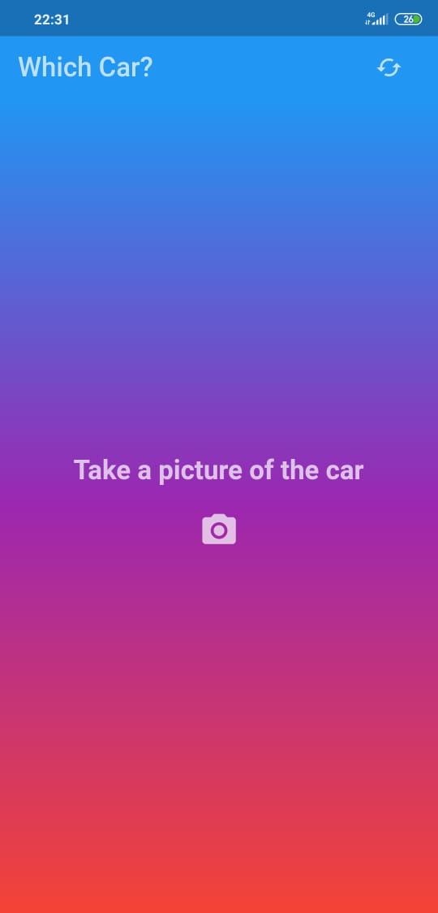
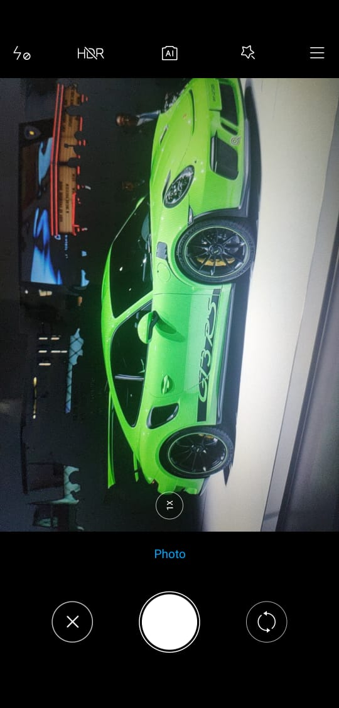
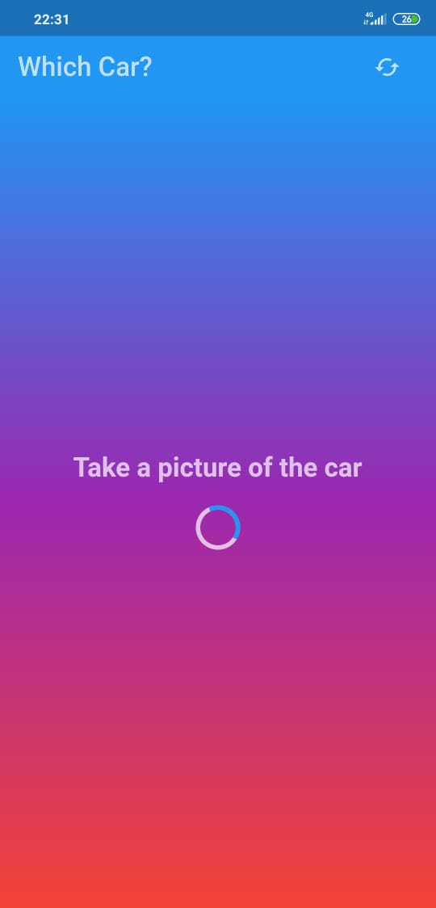
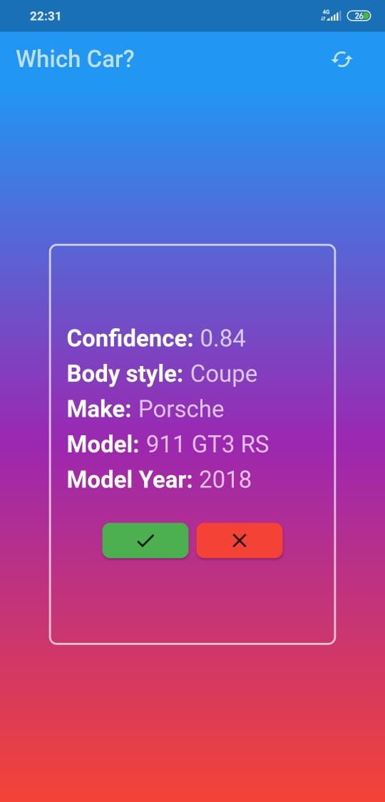

<h1 align="center">
  
<br>
WhichCar - Mobile
</h1>

<p align="center">Take a picture of the car and get it informations.</p>
<p align="center">This app consumes a backend made with Node.js and <a target="_blank" href="https://github.com/iannsantos/which-car-backend">the repo is here</a>.</p>

<p align="center">
  <a href="https://opensource.org/licenses/MIT">
    
  </a>
</p>

<div>
  
  
  
  
</div>

<hr />

## Features
This app features all the latest tools and practices in mobile development!

- **Slidy** — CLI package manager and template for flutter
- **Modular** — A smart project structure.
- **Dio** — A powerful Http client for Dart, which supports Interceptors, Global configuration, FormData, Request Cancellation, File downloading, Timeout etc.
- **Mobx** — Supercharge the state-management in your Dart apps with Transparent Functional Reactive Programming (TFRP)

## Getting started
1. Clone this repository:
```
git clone https://github.com/iannsantos/which-car-mobile
```
2. Open the code in your favorite editor (I recommend VSCode) and execute "Get packages".

### Emulator method
3. Change the ImageSource to gallery at line 86-87 (**home_page.dart**), as exemple below. 
```dart
var image = await ImagePicker.pickImage(
  source: ImageSource.camera);
```
4. Run the emulator and have fun.

### Device method
3. Run the app in your device and have fun, or install apk (maybe, I also upload the app on Play Store).

## License

This project is licensed under the MIT License - see the [LICENSE](https://opensource.org/licenses/MIT) page for details.
